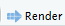

# masa-quarto

Une extension [Quarto](https://quarto.org) qui intègre la charte graphique du [Masa](https://agriculture.gouv.fr/) pour réaliser des diaporamas revealjs.
   

## Installation

Pour démarrer une nouvelle présentation :

``` bash
quarto use template ddotta/masa-quarto
```
 
### Clône

- Vous pouvez clôner ce dépôt gitlab sur votre machine avec l'instruction :  

 ``` bash
 git clone https://github.com/ddotta/masa-quarto.git
 ```

## Obtenir la présentation

- Avec le terminal :  

``` bash
quarto render mondocument.qmd
```

- Avec RStudio :  

Ouvrir le fichier `.qmd` et cliquer sur le bouton 

- Avec VS Code :

Installer [l'extension Quarto](https://marketplace.visualstudio.com/items?itemName=quarto.quarto) puis cliquer sur le bouton 

## Pour aller plus loin

Lire la [documentation Quarto sur le format revealjs](https://quarto.org/docs/presentations/revealjs/)